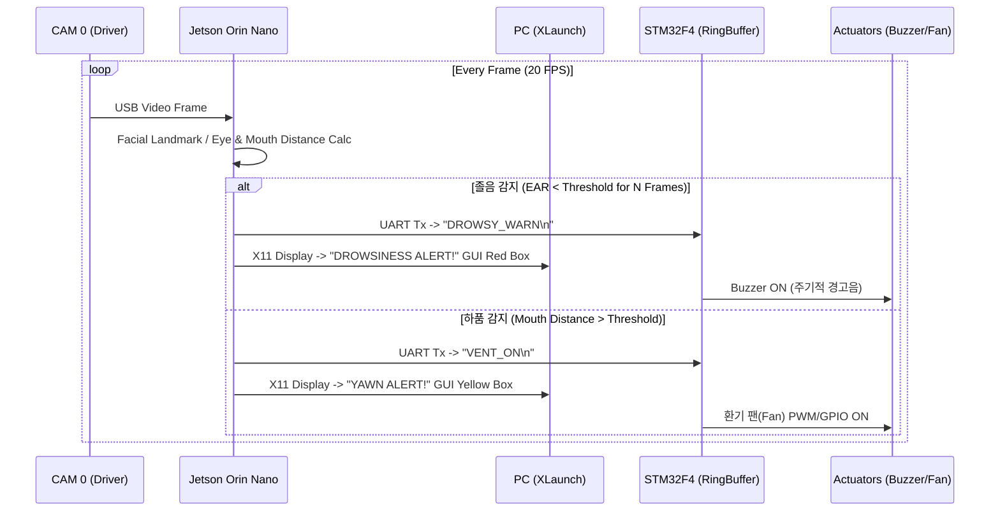
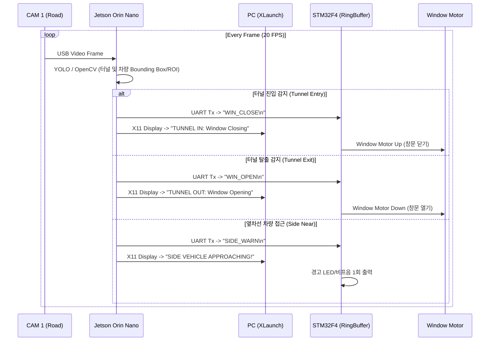

# 졸지마라 — 비전 기반 졸음 감지 및 도로 환경 통합 안전 제어 시스템 상위 설계서 v1.0

> Smart Vision & Safety Motion Control System — High-Level Design Document

---

## 1. 주제 및 목표

### 1-1 주제
본 시스템은 **Jetson Orin Nano 기반의 듀얼 비전 AI 관제 시스템**과 **STM32F4 기반의 임베디드 액추에이터 제어기**, 그리고 **PC 렌더링 관제 GUI**가 이더넷(Ethernet) 및 UART 통신으로 결합된 **운전자 졸음 방지 및 도로 환경(터널/차간거리) 통합 안전 제어 시스템**이다. 

두 개의 USB 카메라(CAM0, CAM1)를 통해 운전자 상태와 전방 도로 환경을 동시에 실시간으로 추적·인지하며, 판단된 위험 상태 및 제어 명령을 STM32F4(액추에이터 제어)와 PC GUI(X11 Forwarding)로 각각 전달하여 즉각적인 하드웨어 경고 및 창문 제어, visual 모니터링을 수행한다.

### 1-2 목표
* **운전자 상태 실시간 모니터링 (CAM0)**: Dlib/MediaPipe 또는 YOLO 기반의 안면 특징점 추적으로 눈 감음(졸음) 및 하품을 인지하고, 위험 단계별 경고 발생
* **전방 도로 및 환경 실시간 인지 (CAM1)**: YOLO/OpenCV 기반의 터널 진입/탈출 인식, 차간거리 계산 및 옆 차선 차량 근접 감지
* **하드웨어 액추에이터 통합 제어**: STM32F4와 UART(115200 bps) 통신을 통해 졸음 경고 부저, 환기 팬, 창문 제어 서보모터/DC모터를 실시간으로 구동
* **분산 모니터링 구축**: Jetson Orin Nano에서 추론한 영상 및 처리 결과를 PC(X11 Forwarding / Ethernet) GUI로 분리 렌더링하여 모니터링 환경 확보

### 1-3 시스템 개요

```
[ CAM 0 (안면/졸음) ] ──(USB)──┐
                              ├──> [ Jetson Orin Nano (메인 연산/AI 추론) ] ──(Ethernet / X11)──> [ PC (GUI 모니터링) ]
[ CAM 1 (주행/환경) ] ──(USB)──┘                   │
                                           (UART Serial 115200)
                                                  ▼
                                      [ STM32F4 (하드웨어 제어) ]
                                                  │
                ┌─────────────────────────────────┼─────────────────────────────────┐
                ▼                                 ▼                                 ▼
          [ 경고 부저 ]                        [ 환기 팬 ]               [ 창문 제어 모터 (UP/DOWN) ]
```

### 1-4 프로젝트 폴더 구조

```text
work/
└── zolzimala/
    ├── orin_nano/
    │   ├── uart.py
    │   ├── cam0.py
    │   ├── cam1.py
    │   ├── gui.py
    │   └── main.py
    └── stm32/
        ├── uart.c
        ├── buzzer.c
        └── main.c
```

---

## 2. 개발 목표 및 개발 결과

### 2-1 개발 목표 및 기능 명세

| 기능 | 담당 모듈 | 구현 목표 | 비고 |
| --- | --- | --- | --- |
| **운전자 안면 프레임 수집** | Jetson (CAM0 / USB) | 20 FPS 실시간 획득 | 운전자 정면 조향 배치 |
| **졸음 및 하품 감지** | Jetson (`CAM0` AI/OpenCV) | EAR(Eye Aspect Ratio) 및 입 거리 기반 졸음/하품 인지 | 일정 시간 지속 시 이벤트 트리거 |
| **전방 도로 프레임 수집** | Jetson (CAM1 / USB) | 20 FPS 실시간 획득 | 차량 전방 조향 배치 |
| **터널 진입 및 탈출 인식** | Jetson (`CAM1` AI/OpenCV) | 조도 변화 및 터널 입구 Object Detection | 진입/탈출 상태 래치 제어 |
| **차간거리 및 옆차선 근접 감지**| Jetson (`CAM1` YOLO) | Bounding Box 면적/위치 기반 거리 및 옆차선 접근 감지 | 위험 레벨 산출 |
| **PC GUI 모니터링** | PC (X11 Forwarding) | Jetson에서 추론된 듀얼 카메라 화면 및 상태 GUI 표시 | Ethernet 연결 |
| **UART 패킷 송수신** | Jetson ↔ STM32F4 | ASCII/HEX 제어 명령 전송 및 상태 Echo 수신 | 115200 bps |
| **졸음/환기 액츄에이터 제어** | STM32F4 (Buzzer, Fan) | 경고 신호 수신 시 부저 울림 및 환기 팬(PWM/GPIO) 동작 | 하드웨어 즉각 반응 |
| **창문 자동 제어** | STM32F4 (Motor) | 터널 진입 시 창문 닫기(UP), 탈출 시 창문 열기(DOWN) | 서보 또는 DC모터 제어 |

### 2-2 계층별 책임

| 계층 | 주 책임 | 하지 않는 것 |
| --- | --- | --- |
| **입력부 (CAM0, CAM1)** | - USB 비디오 스트림을 통한 실시간 프레임 제공 | - 데이터 분석 및 파싱 |
| **메인 연산부 (Jetson Orin Nano)** | - CAM0/CAM1 듀얼 영상 AI 추론 및 처리<br>- 졸음/하품/터널/근접차량 상태 판단 알고리즘 수행<br>- STM32F4 제어 명령 패킷 생성 및 UART 전송<br>- PC로 X11/Ethernet 모니터링 데이터 전달 | - 물리 액추에이터 직접 제어 (GPIO 직접 드라이브 최소화)<br>- 모터 PWM 직접 생성 |
| **제어 및 출력부 (STM32F4)** | - UART 제어 명령어 수신 및 패킷 파싱<br>- 부저, 환기 팬, 창문 모터 하드웨어 타이머/PWM/GPIO 제어<br>- 하드웨어 센서/스위치 예외 인터럽트 처리 | - 비전 알고리즘 연산<br>- 프레임 버퍼 저장 |
| **디스플레이부 (PC XLaunch)** | - Ethernet 기반 X11 Forwarding을 통한 듀얼 영상 및 GUI 렌더링 | - 비전 추론 및 제어 명령 결정 |

---

## 3. 데이터 흐름

### 3.1 흐름 A — CAM0 (운전자 모니터링) 및 졸음/환기 액추에이터 제어



### 3.2 흐름 B — CAM1 (전방 주행) 및 터널/차간거리/창문 제어



---

## 4. 인터페이스 및 프로토콜 정의

### 4.1 시스템 하드웨어 연결 인터페이스

| 연결 구간 | 통신 방식 / 물리 계층 | 목적 및 명세 |
| --- | --- | --- |
| **CAM0 ↔ Jetson** | USB 2.0 / 3.0 | 운전자 촬영 (720p @ 20fps) |
| **CAM1 ↔ Jetson** | USB 2.0 / 3.0 | 전방 주행 촬영 (1080p / 720p @ 20fps) |
| **Jetson ↔ STM32F4** | UART (TTL 3.3V) | 115200 bps, 8 Data, No Parity, 1 Stop bit |
| **Jetson ↔ PC** | Ethernet (RJ45) | TCP/IP 기반 X11 Forwarding 모니터링 |

### 4.2 제어 명령 집합 (Jetson Orin Nano → STM32F4)

| 전송 패킷 (ASCII) | 기능 정의 | STM32F4 처리 동작 |
| --- | --- | --- |
|DROWSY_WARN| 졸음 경고 발생 | 경고 부저(Buzzer) 지속 패턴 출력 |
|DROWSY_OK| 졸음 상태 해제 | 경고 부저 Off |
|VENT_ON| 환기 요청 (하품 감지) | 환기 시스템 팬(Fan) 10초간 동작 |
|VENT_OFF| 환기 정지 | 환기 시스템 팬 Off |
|WIN_CLOSE| 창문 닫기 (터널 진입) | 창문 제어 모터 정방향 구동 (Window Up) |
|WIN_OPEN| 창문 열기 (터널 탈출) | 창문 제어 모터 역방향 구동 (Window Down) |
|SIDE_WARN| 옆차선 근접 경고 | 단발성 비프음 / 경고 LED 토글 |

---

## 5. 계층별 상세 설계

### 5.1 Jetson Orin Nano 애플리케이션 계층

#### [1] 멀티 스레드 듀얼 비전 파이프라인
* **스레드 1 (CAM0 - Driver Monitor)**:
  1. `cv::VideoCapture(0)` 또는 OpenCV/OpenMAX 기반 획득 (20 FPS)
  2. 안면 ROI 추출 및 눈/입 Landmark Coordinate 산출
  3. EAR(Eye Aspect Ratio) 연산 및 지속 프레임 카운팅 $\rightarrow$ `DROWSY_WARN` 전송 래치
  4. 입 벌림 거리(Mouth Distance) 연산 $\rightarrow$ `VENT_ON` 전송 래치

* **스레드 2 (CAM1 - Road Monitor)**:
  1. `cv::VideoCapture(1)` 기반 전방 프레임 획득 (20 FPS)
  2. YOLOv8/v11 모델을 통한 차종 및 터널, 차선 ROI 검출
  3. 전방 차간거리 추정 및 옆 차선 Bounding Box 좌표 범위(Overlap) 계산
  4. 터널 밝기 변화 및 형태 감지 알고리즘 적용 $\rightarrow$ `WIN_CLOSE` / `WIN_OPEN` 상태 업데이트

#### [2] 상태 래치 및 패킷 전송 최적화 (State Latch Manager)
* 프레임 단위(50ms)로 매번 UART 메시지를 전송할 경우 발생할 수 있는 통신 병목을 방지하기 위해, 상태 변동 시점(`On State Change`)에만 단 1회 명령 패킷을 전송하는 Latch 메커니즘을 적용한다.

---

## 5.2 STM32F4 펌웨어 계층

#### [1] 링버퍼(Ring Buffer) 기반 UART 수신
* UART2/3 RX Interrupt 발생 시 전달받은 Byte 데이터를 지연 없이 링버퍼에 적재
* `Main Loop`에서 개행문자(`\n`) 단위로 수신 프레임을 조립하고 CLI 파서를 통해 명령(`DROWSY_WARN`, `WIN_CLOSE` 등) 판별

#### [2] 하드웨어 타이머 및 PWM 액츄에이터 제어
* **부저 제어**: TIM3 PWM 제어를 통해 졸음 위험 수준에 맞는 경고음 주파수 발생
* **환기 팬 제어**: GPIO Output 또는 TIM4 PWM을 통한 DC 팬 속도 및 온/오프 제어
* **창문 제어 모터**: 리밋 스위치 인터럽트(EXTI)와 연동하여 안전하게 창문 모터를 지정된 위치(Up/Down)까지 구동

---

## 6. 대표 운용 시나리오

### 6.1 운전자 졸음/하품 발생 시 시나리오
1. 운전자가 연속 20프레임 이상 눈을 감고 있음을 CAM0을 통해 Jetson이 인식한다.
2. Jetson은 PC 관제 화면(X11)에 적색 경고 창을 띄움과 동시에, UART로 `DROWSY_WARN\n` 명령을 전송한다.
3. STM32F4는 패킷 수신 즉시 부저를 지속적으로 울려 운전자의 깨움을 유도한다.
4. 운전자가 하품을 진행할 경우 Jetson이 `VENT_ON\n` 명령을 보내고, STM32F4는 환기 팬을 동작시켜 차내 공기를 환기한다.

### 6.2 터널 진입 및 차선 변경 위험 시나리오
1. CAM1을 통해 전방의 터널 진입이 감지되면 Jetson은 `WIN_CLOSE\n` 명령을 전송한다.
2. STM32F4는 창문 제어 모터를 구동하여 창문을 자동으로 올린다.
3. 주행 중 옆 차선의 차량이 위험 거리 이내로 접근함을 CAM1(YOLO)이 인식하면, PC 화면 표시와 함께 STM32F4를 통해 단발성 알림을 발생시킨다.
4. 터널을 탈출하면 Jetson이 `WIN_OPEN\n` 명령을 전송하여 창문을 원래 상태로 내린다.

---

## 7. 기술 스택 요약

| 계층 | 사용 기술 / 라이브러리 | 주요 역할 |
| --- | --- | --- |
| **메인 연산부 (Jetson)** | Linux (Ubuntu), PyTorch, YOLOv8/v11, OpenCV, Dlib/MediaPipe, C++/Python | 듀얼 비전 추론, 상태 판단, 패킷 전송 |
| **제어 및 출력부 (STM32F4)**| Bare-metal C, CMSIS, Ring Buffer, TIM PWM, EXTI | UART 수신 및 파싱, 부저/팬/모터 제어 |
| **디스플레이부 (PC)** | Linux / Windows XServer (XLaunch), Ethernet, SSH | GUI 원격 모니터링 렌더링 |
| **통신 프로토콜** | ASCII 기반 Custom Packet | UART (115200 8N1), TCP/IP (Ethernet X11) |

---

## 8. 설계 특성 및 확장 지점

* **듀얼 카메라 기반의 데이터 분리 처리**: 운전자 내부 모니터링(CAM0)과 외부 주행 환경(CAM1)을 독립된 스레드로 분리 처리하여 실시간성을 극대화함.
* **비동기 임베디드 통신 구조**: Jetson과 STM32F4 간 통신 시 링버퍼 기반 비동기 수신을 채택하여, 액추에이터 제어 중에도 제어 패킷 손실이 발생하지 않도록 보장함.
* **확장 지점**:
  1. **CAN 통신 확장**: 추후 STM32F4와 차량 내부 CAN Bus 망을 연동하여 실제 차량의 창문/환기 조작 신호와 직접 동기화 가능.
  2. **차량 속도 감지 연동**: GPS 모듈 또는 차륜 속도 센서를 STM32F4에 추가 연동하여 차간거리 기준을 가변적으로 적용하는 과속 방지 로직 보완 가능.
